<h1 align="center">DS1 Studio</h1>

  <b>A modern map editor for classic Diablo II — DS1 map presets and DT1 tile libraries.</b> 
  A replacement for WinDS1, for Windows and Linux.

  <a href="https://github.com/RoofooEvazan/ds1-studio/releases/latest"><b>⬇ Download</b></a> ·
  <a href="#features">Features</a> ·
  <a href="#keyboard-shortcuts">Shortcuts</a> ·
  <a href="https://github.com/RoofooEvazan/ds1-studio/issues/new?template=bug_report.md">Report a bug</a>

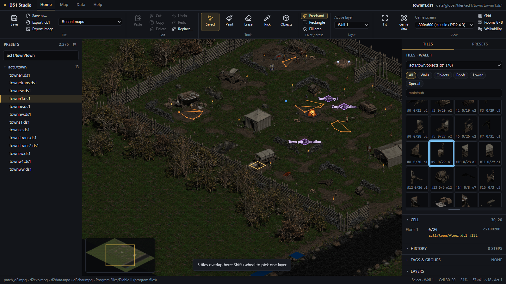

DS1 Studio opens the maps straight from your Diablo II install and your mod folder, draws them the way the game does
(GPU-rendered, with the right palettes, animated floors and object sprites), and lets you edit tiles, objects, the
game's level tables, the automap and even the DT1 tiles themselves. Everything it saves goes into your mod folder,
with a backup of anything it replaces; your game install is only ever read.

Made for classic Diablo II **1.13 / 1.14** (DS1 versions 1–18, DT1 v7.6) and mods built on it.

---

## Download & install

Get the latest version from the [**Releases page**](https://github.com/RoofooEvazan/ds1-studio/releases/latest).

| System | File | Notes |
| --- | --- | --- |
| **Windows 10/11** | `DS1.Studio_x.y.z_x64-setup.exe` | Recommended. Installs for your user, adds a Start menu entry, updates itself. |
| | `DS1.Studio_x.y.z_x64_en-US.msi` | For managed/enterprise installs. |
| **Linux** | `DS1.Studio_x.y.z_amd64.AppImage` | Runs on most distributions; `chmod +x` it and double-click. Updates itself. |
| | `DS1.Studio_x.y.z_amd64.deb` | Debian, Ubuntu, Mint… (`sudo apt install ./DS1.Studio_*.deb`) |
| | `DS1.Studio-x.y.z-1.x86_64.rpm` | Fedora, openSUSE… (`sudo dnf install ./DS1.Studio-*.rpm`) |

> **Windows says “Windows protected your PC”?** The installer isn't code-signed yet, so SmartScreen doesn't know the
> publisher. Click **More info → Run anyway**. The source and the build that produced every release are public in this
> repository.

**First start:** DS1 Studio asks for your Diablo II folder, your mod folder(s), and optionally your WinDS1 folder
(used for object names and special-tile graphics). On Linux, point it at the Diablo II folder inside your Wine prefix
(e.g. `~/.wine/drive_c/Program Files (x86)/Diablo II`). You can change these later.

**Updates:** the app checks GitHub once a day and tells you when a new version is out. **Help → Check for updates**
downloads and installs it and restarts the app. (Installs from `.deb`/`.rpm` packages get a link to the new release.)

---

## Features

### See maps the way the game draws them

- Opens every DS1 in the game and your mod, straight from the MPQs and loose files — no extracting.
- Picks the same tile libraries (DT1s) the game would, from `LvlPrest.txt` → `Levels.txt` → `LvlTypes.txt` and the
  preset's `Dt1Mask`, and the right act palette.
- Floors, walls, roofs, shadows, lower walls, animated tiles, special tiles, objects and NPCs with their real sprites
  — **animated in real time** at the game's own speeds, with fire, glows, magic and fog blended like in game — NPC
  paths, substitution groups. Objects that show their sprite don't get a marker on top (hover or select one to see its
  name); object mode shows them all.
- Smooth zooming and panning on the GPU, even on 150×150 maps. At 100% you see exactly the game's pixels; zoomed out,
  tiles are properly downscaled instead of turning grainy.

| | |
| :-: | :-: |
| 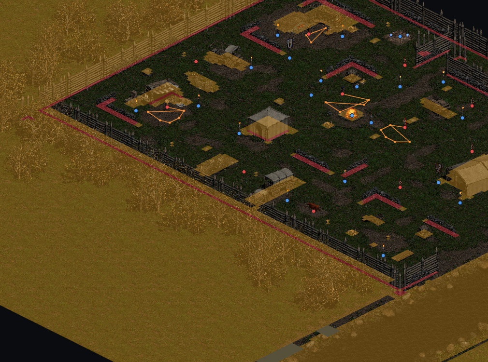 **Walkability** — which sub-tiles block walking or jumping (**W**) | 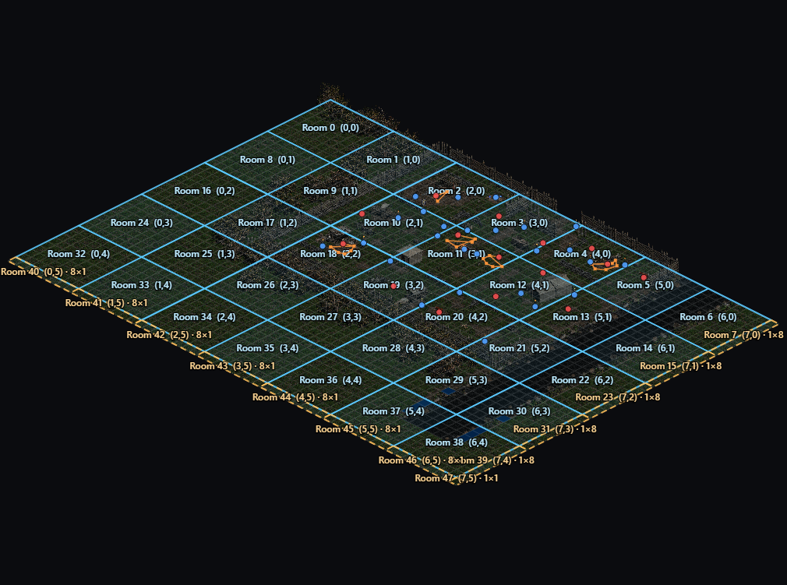 **Rooms & grid** — the 8×8-tile rooms the game builds levels from (**R**, **G**) |
| 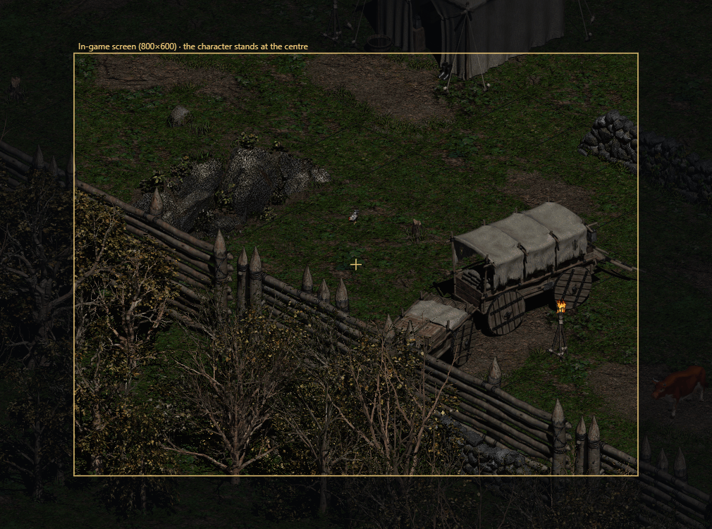 **Game view** — what the character sees at 640×480, 800×600, PD2's 1068×600 widescreen or any custom size (**Z**) | 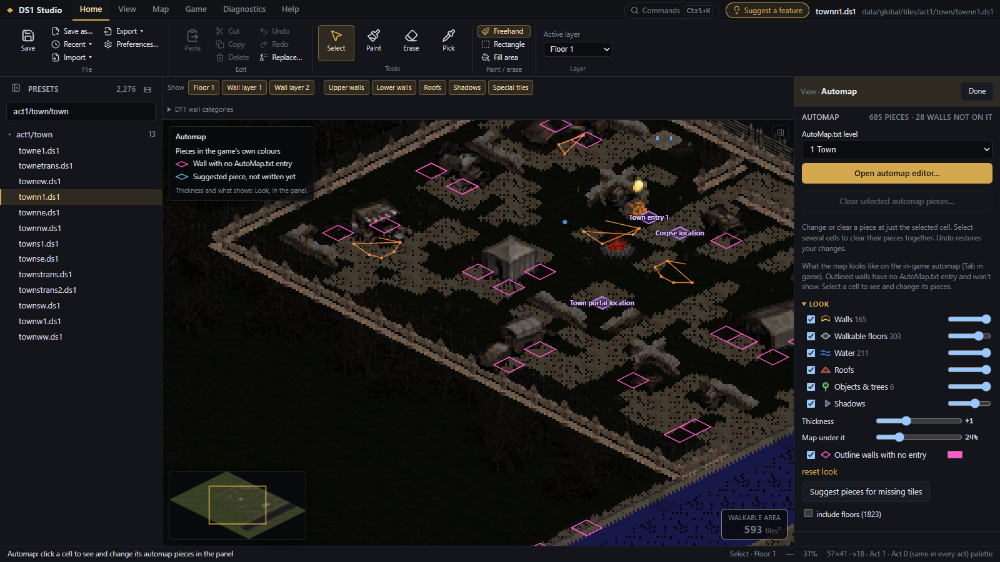 **Automap preview** — the in-game automap, drawn from AutoMap.txt (**A**) |

Pan with the **arrow keys** (hold Shift to go faster), Space+drag or the middle/right mouse button:

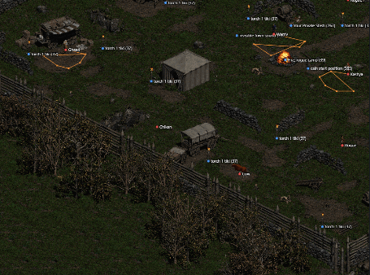

### Edit tiles

- **Paint, erase, pick** tiles on any layer; **select** areas to fill, copy, cut, paste or move them — objects come
  along. Unlimited undo/redo.
- **Click a tile and it's shown in its DT1** in the Tiles panel, with its main/sub index, orientation and source file.
- **Overlapping tiles** (trees over trees, a wall over a floor): hold **Shift** and turn the mouse wheel to step
  through them one at a time; only that tile's layer is selected, so copy/cut/Delete leave the others alone.
- **Hold Alt** when placing a paste or preset to stack it onto what's there (it goes into the next free wall/floor
  layer, adding layers as needed) instead of replacing it.
- **Copying between maps:** if the map you paste into doesn't load the DT1s the tiles came from, DS1 Studio says so and
  offers to add them.
- Resize maps by dragging their edges, create new maps, edit per-cell flags, tags and groups.

| | |
| :-: | :-: |
| 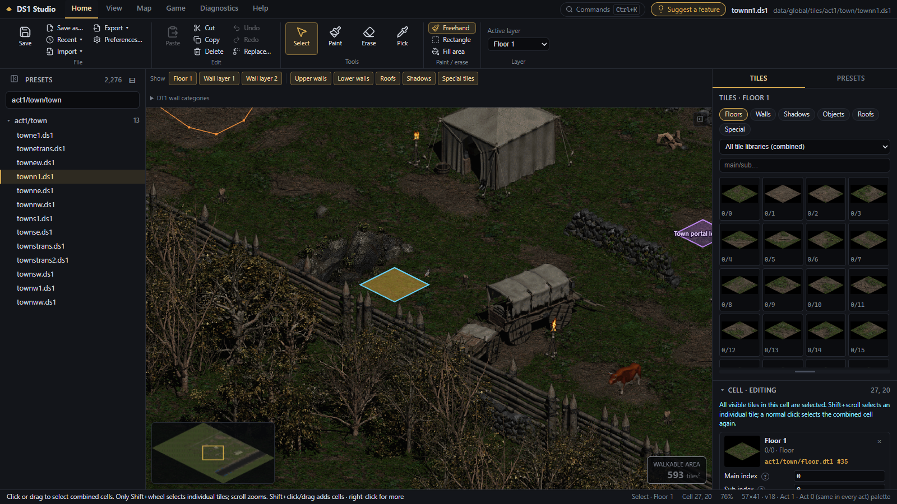 **Click a tile** — it's highlighted in its DT1 | 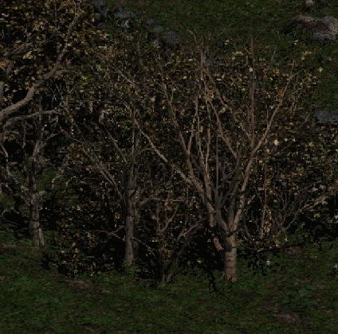 **Shift + wheel** through stacked tiles |

### Objects & NPCs

Every object and NPC for the act as a sprite gallery — click one, then click the map to place it. Animated previews,
names, and **Tab** to switch between tile and object editing like WinDS1.

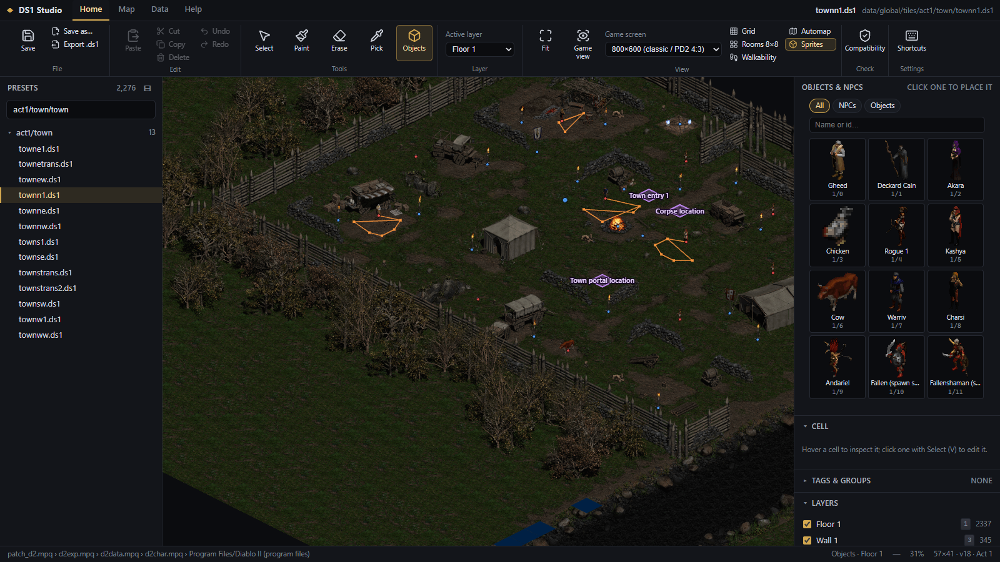

### Presets

Save any selection as a reusable **preset** (stored in your mod folder, so it travels with it), or let DS1 Studio
**suggest presets** by finding structures that recur across the maps sharing this map's tiles — buildings, wall runs,
tree groups.

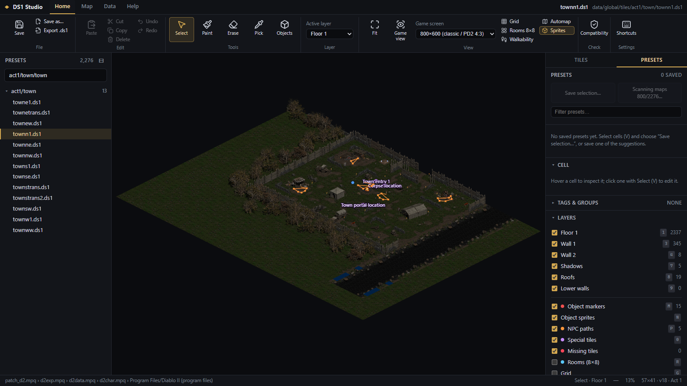

### Tile libraries & the DT1 editor

- **Tile libraries** window: add or remove DT1s for the map and browse every tile of any DT1 before adding it.
  DS1 Studio keeps the game in step: new DT1s go into free `File` slots in `LvlTypes.txt` and the map's `Dt1Mask` in
  `LvlPrest.txt` is recomputed.
- **DT1 editor**: duplicate and rename a DT1, **recolour** it (hue, saturation, brightness, tint, replace a colour) —
  the whole file, tiles you pick, the tiles a preset is built from, or the tiles used in your map selection — and
  **paint tiles pixel by pixel** with the act palette. Clicking a tile opens it in a zoom window you can move, resize
  from any edge and zoom right down to single pixels. The preview is exact, and the copy can replace the original in
  your map with the tables updated for you.

| | |
| :-: | :-: |
| 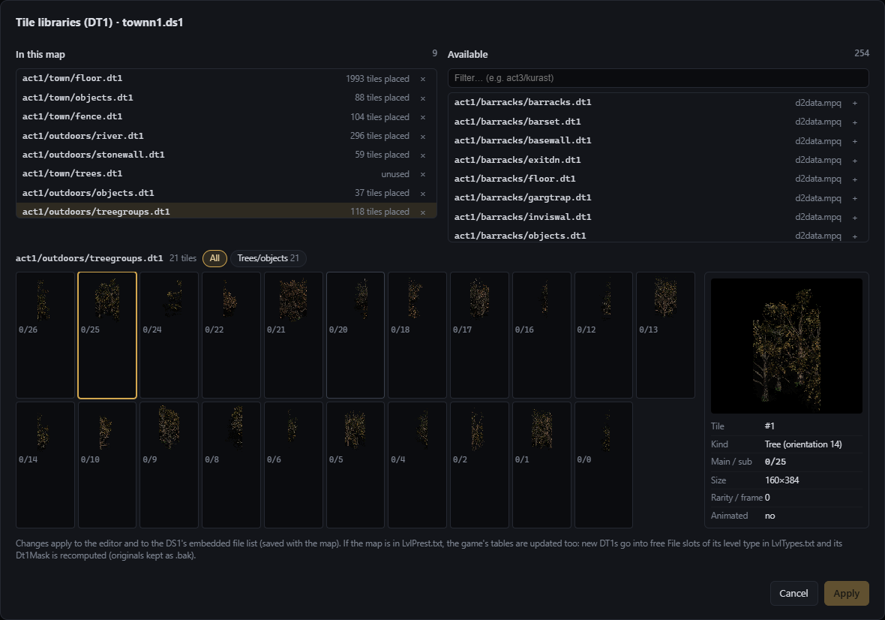 **Tile libraries** with the DT1 viewer | 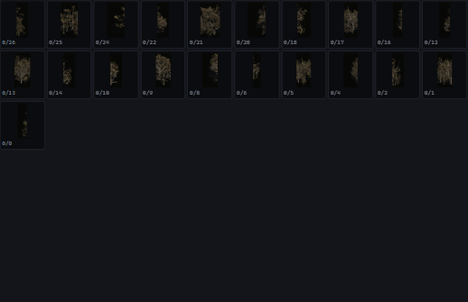 **Recolour** tiles (hue shown) |
| 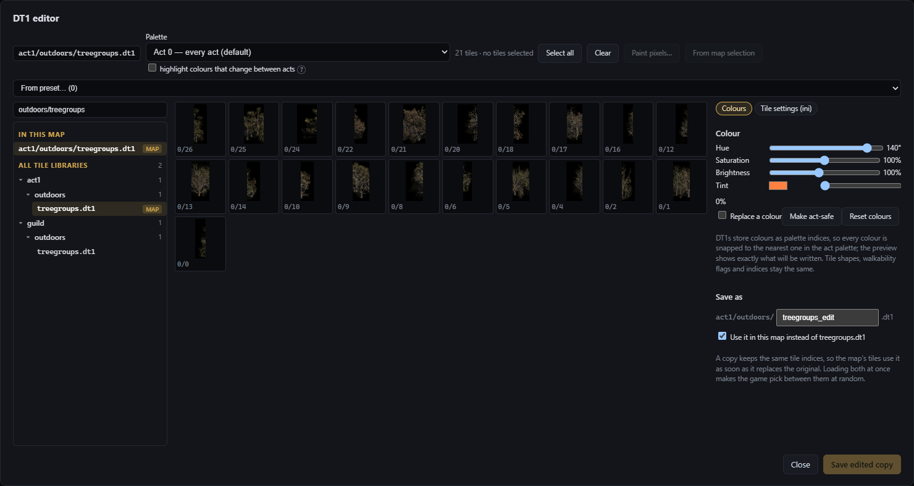 **DT1 editor** | 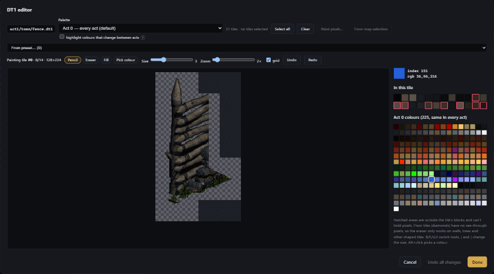 **Pixel painting** |

### Automap

Toggle the in-game automap over your map (**A**) to see what players will see. Walls outlined in **pink** have no
AutoMap.txt entry, so the automap draws nothing there.

The **Automap editor** (Map → Automap editor) lists every kind of tile the map uses, grouped (floors, walls, corners,
doors, columns, trees…), with the real tile image next to the automap piece it gets — or a **missing** / **hidden**
badge. Select kinds in the list (Shift/Ctrl for several) or click spots on the live automap preview, then pick pieces
from the gallery: set one, add up to four random variants, **hide** a kind on purpose (so it's no longer "missing"), or
**Suggest** the piece your level or act normally uses. Nothing is written until **Save to AutoMap.txt**, and saving
again replaces the editor's earlier rows instead of piling them up.

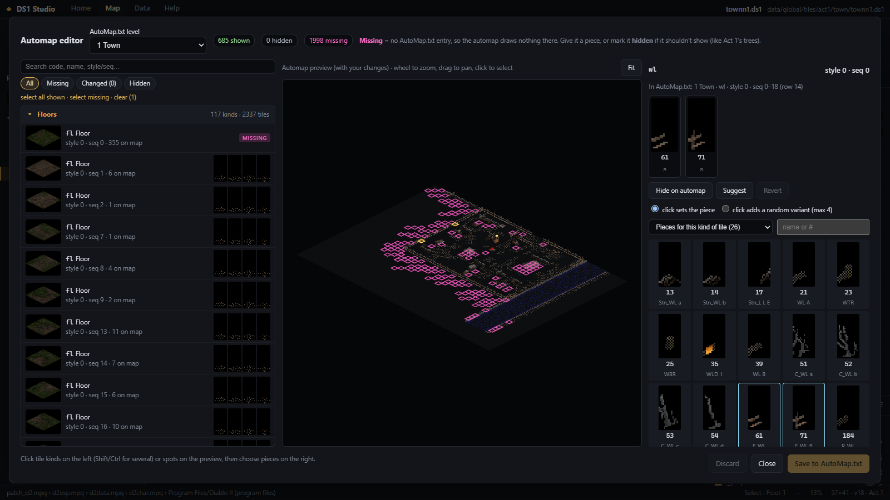

| | |
| :-: | :-: |
| 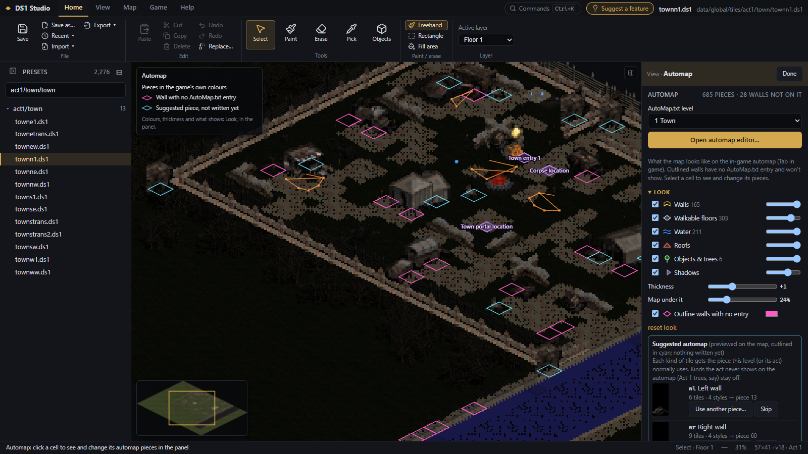 **Suggested pieces** previewed in cyan | 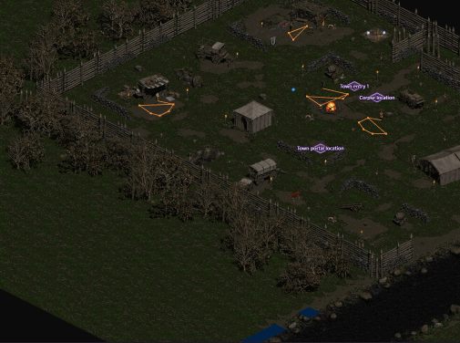 **Automap on/off** |

### Game data without opening .txt files

- **Data tables:** browse and edit any `.txt` table in a spreadsheet view, with a **?** on column headers that explains
  what the column does in plain language.
- **Add to game:** creates the `LvlPrest`/`Levels`/`LvlTypes` rows that make the game load a new map.
- **Cube recipe:** creates a map item and a Horadric Cube recipe for it (the item-to-level link needs a mod plugin,
  e.g. PD2's map system).
- **Compatibility check:** missing tiles and DT1s, table wiring, DT1s used but not loaded by the level type, entry
  markers, NPCs on unwalkable ground, stacked objects, compiled `.bin` reminders — with one-click fixes where possible.

| | |
| :-: | :-: |
| 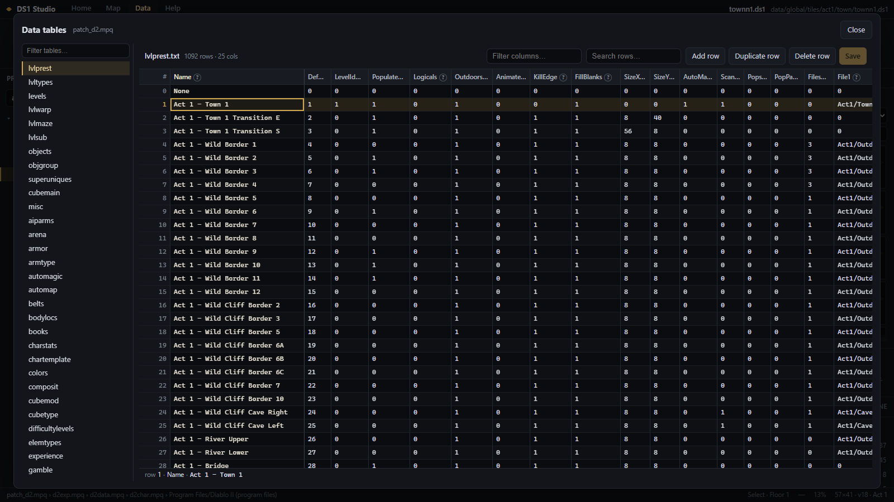 **Data tables** | 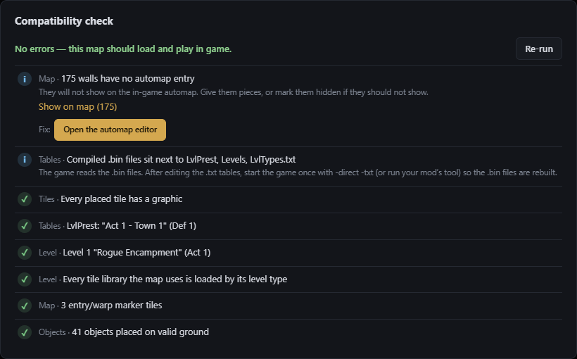 **Compatibility check** |

### Share maps

**Map → Export package** puts the DS1, its DT1s, any modded object sprites and every table row the map needs
(`LvlPrest`, `Levels`, `LvlTypes`, its `LvlWarp`/`LvlMaze` rows and a cube recipe made for it) into one `.zip`.
**Import package** merges it into someone else's mod safely: same-named rows are reused, clashing ids get new numbers,
DT1s go into free slots and `Dt1Mask` is recomputed against their tables. Importing the same map twice changes nothing.

### Ribbon

  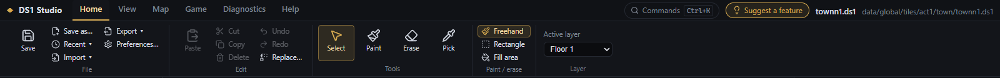 
  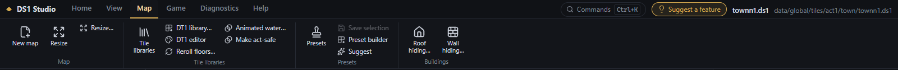 
  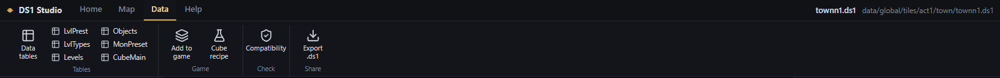 
  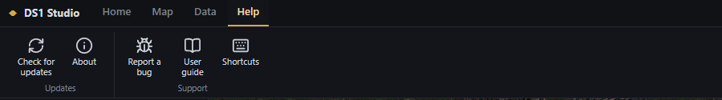

**Help** has **Check for updates**, **About** (version and build), **Report a bug** (opens a pre-filled GitHub issue
with your version, system and map), the user guide and the shortcuts.

---

## Keyboard shortcuts

Every shortcut can be changed in **Help → Shortcuts** (or the ribbon's Shortcuts button); changes are remembered on
your computer.

<table><tr><td valign="top">

**Tools**

| Action | Default key |
| --- | --- |
| Select tool | <kbd>V</kbd> |
| Paint tool | <kbd>B</kbd> |
| Erase tool | <kbd>E</kbd> |
| Pick tool | <kbd>I</kbd> |
| Objects tool | <kbd>O</kbd> |
| Toggle tiles / objects editing (like WinDS1) | <kbd>Tab</kbd> |

**File**

| Action | Default key |
| --- | --- |
| Save | <kbd>Ctrl</kbd> + <kbd>S</kbd> |

**Edit**

| Action | Default key |
| --- | --- |
| Undo | <kbd>Ctrl</kbd> + <kbd>Z</kbd> |
| Redo | <kbd>Ctrl</kbd> + <kbd>Y</kbd> |
| Redo (alternative) | <kbd>Ctrl</kbd> + <kbd>Shift</kbd> + <kbd>Z</kbd> |
| Copy | <kbd>Ctrl</kbd> + <kbd>C</kbd> |
| Cut | <kbd>Ctrl</kbd> + <kbd>X</kbd> |
| Paste | <kbd>Ctrl</kbd> + <kbd>V</kbd> |
| Select all | <kbd>Ctrl</kbd> + <kbd>A</kbd> |
| Cancel / deselect | <kbd>Escape</kbd> |
| Delete (active layer / object) | <kbd>Delete</kbd> |
| Delete all layers | <kbd>Shift</kbd> + <kbd>Delete</kbd> |

</td><td valign="top">

**View**

| Action | Default key |
| --- | --- |
| Fit map | <kbd>F</kbd> |
| Game view (what the character sees) | <kbd>Z</kbd> |
| Grid | <kbd>G</kbd> |
| Game rooms (8×8) | <kbd>R</kbd> |
| Walkability | <kbd>W</kbd> |
| Automap preview | <kbd>A</kbd> |
| Object markers | <kbd>M</kbd> |
| Object sprites | <kbd>N</kbd> |
| NPC paths | <kbd>P</kbd> |

**Layers** (show / hide)

| Action | Default key |
| --- | --- |
| Floor 1 / Floor 2 | <kbd>1</kbd> / <kbd>2</kbd> |
| Wall 1 – Wall 4 | <kbd>3</kbd> – <kbd>6</kbd> |
| Shadows | <kbd>7</kbd> |
| Roofs | <kbd>8</kbd> |
| Lower walls | <kbd>9</kbd> |
| Special tiles | <kbd>0</kbd> |

</td></tr></table>

**Mouse & navigation**

| Action | Control |
| --- | --- |
| Pan the map | Arrow keys (<kbd>Shift</kbd> = faster), <kbd>Space</kbd> + drag, middle or right drag |
| Zoom | Mouse wheel |
| Step through stacked tiles | <kbd>Shift</kbd> + wheel |
| Stack a paste / preset onto existing tiles | <kbd>Alt</kbd> + click |
| Zoom tile / object thumbnails | <kbd>Ctrl</kbd> + wheel over the panel |
| Select a range of tiles (DT1 editor) | <kbd>Shift</kbd> + click |

**Pixel painter** (DT1 editor): <kbd>B</kbd> pencil · <kbd>E</kbd> eraser · <kbd>G</kbd> fill · <kbd>I</kbd> colour
picker · <kbd>[</kbd> / <kbd>]</kbd> brush size · <kbd>Alt</kbd>+click picks a colour · <kbd>Ctrl</kbd>+<kbd>Z</kbd> /
<kbd>Ctrl</kbd>+<kbd>Y</kbd> undo / redo · <kbd>Ctrl</kbd>+wheel zoom.

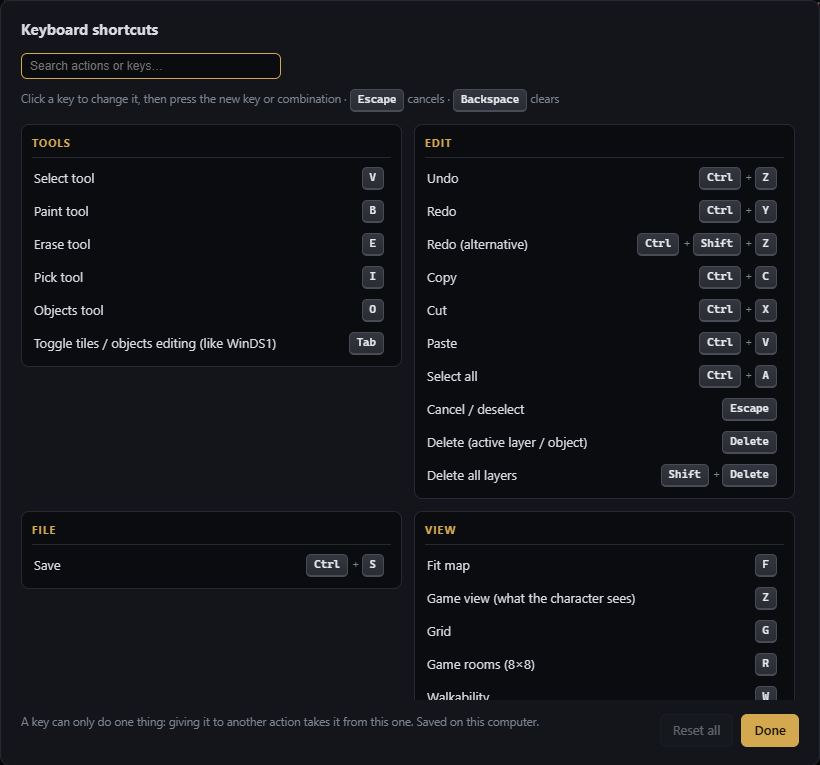

---

## Safety

- Your **game install is never written to**. Saves go into your mod folder only.
- The first time a file is replaced, the original is kept next to it as `<name>.bak`.
- The app only reads inside the folders you choose, and only writes map, tile, sprite and table files and its own
  presets inside your mod folder.

## Reporting bugs & ideas

Use **Help → Report a bug** in the app (it fills in your version and system), or
[open an issue](https://github.com/RoofooEvazan/ds1-studio/issues/new/choose). Screenshots help a lot.

## Building from source

See [docs/DEVELOPMENT.md](docs/DEVELOPMENT.md) for running from source, the dev server, tests, releases and code
signing.

## License

[MIT](LICENSE). Diablo II and its data are © Blizzard Entertainment and aren't part of this project.

## Credits

- Diablo II and its data are © Blizzard Entertainment. DS1 Studio reads your own game files and never ships them.
- WinDS1 by Paul Siramy, whose data files (object names, special-tile graphics) DS1 Studio can read from your own
  WinDS1 folder.
- The Phrozen Keep community's documentation of the DS1, DT1 and .txt formats.
